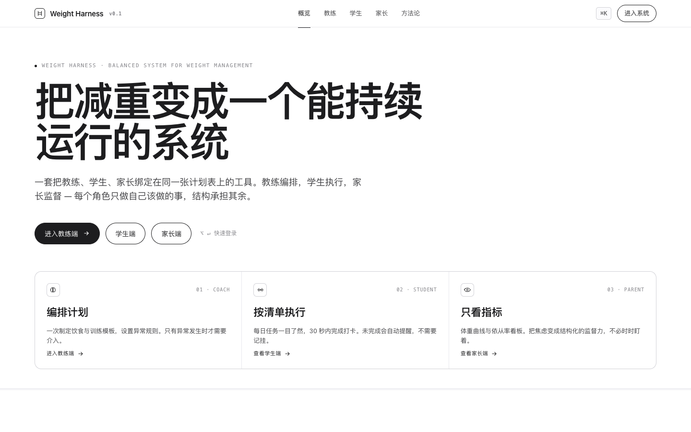
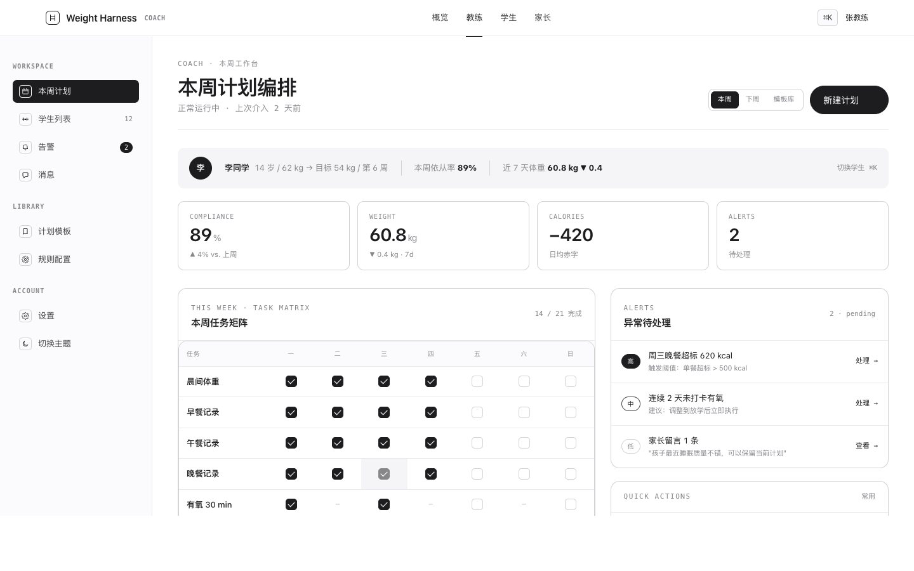
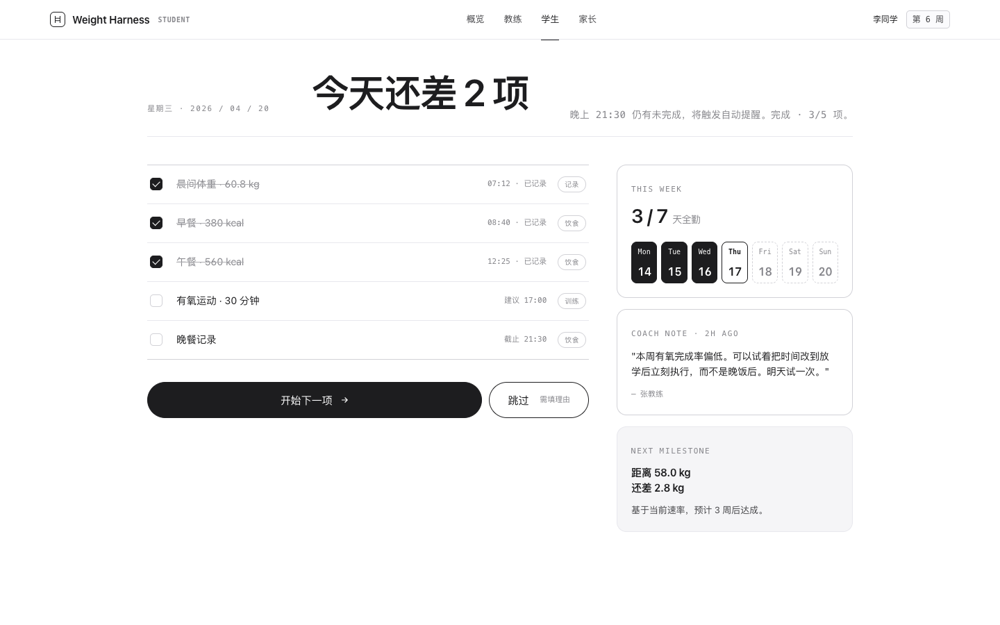
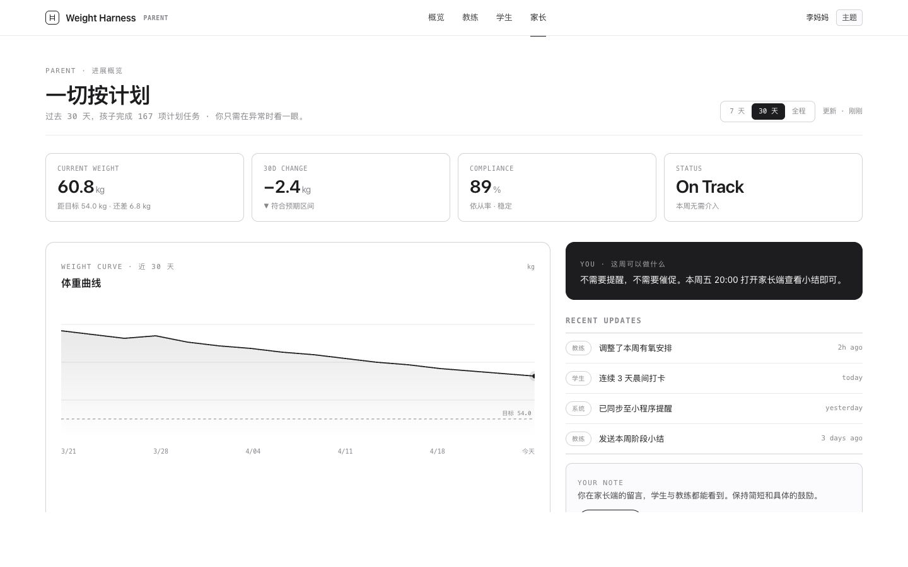

# Weight Harness

> 把减重变成一个能持续运行的系统。
> 教练编排，学生执行，家长监督 — 每个角色只做自己该做的事，结构承担其余。

🌐 **在线 demo**: https://dalaoyuan2020.github.io/weight-harness/



---

## 一、为什么需要 Harness

减重失败 90% 的原因不是方法不对, 而是**系统不收敛**:
- 学生一个人扛全责 → 自我欺骗
- 教练只发计划不跟踪 → 失控
- 家长只看结果不参与过程 → 错过干预窗口

Weight Harness 把这三方装进一个**相互制衡**的最小循环:

```
        🧠 教练 (编排)
       ╱             ╲
      ╱   相互监督     ╲
     ╱                  ╲
💪 学生 (执行) ———— 👁️ 家长 (评估)
```

没有任何一方能独断: 教练不能自己评估自己, 学生不能自己验收自己, 家长不能自己安排自己。

完整哲学见 [MANIFESTO.md](./MANIFESTO.md)。

---

## 二、三个端

### 教练端 — 编排计划


一周任务矩阵 + KPI 看板 + 异常告警。**正常运行不显式介入, 只在依从率掉线时出手**。

### 学生端 — 按清单执行


每天 5 项以内的检查清单, 30 秒打卡完成。未完成自动触发提醒, **不需要记挂**。

### 家长端 — 只看指标


体重曲线 + 依从率看板。**把焦虑变成结构化的监督力**, 不必时时盯看。

---

## 三、设计系统

整体走 **Apple HIG / 开发者文档**风格 — 纯黑白灰, 不靠颜色靠字号与留白引导视线。

| 维度 | 选型 |
|------|------|
| 配色 | `--bg #fff` / `--ink #1d1d1f` / `--muted #86868b` (CSS 变量) |
| 字体 | SF Pro Display (标题) / SF Pro Text (正文) / SF Mono (技术) / PingFang SC (中文) |
| 暗色 | `data-theme="dark"` 一键切换, `localStorage` 记忆 |
| 圆角 | 6 / 10 / 14 / 22 px 四档, 按尺寸递增 |
| 节奏 | 96 px section padding, 60ch 文字宽度上限 |
| 图标 | 24×24 viewBox, 1.5 stroke, 自带 SVG 库 (`icons.js`, 24 个) |

### 三角图动画
首页的三方制衡图不是静态 SVG, 是 `app.js` 里的 stroke-dash draw-in + 三轮脉冲 + 静止态可重放。代码 90 行, 用原生 IntersectionObserver + `getPointAtLength` 实现, 无依赖。

### 零依赖
整站 0 npm package, 0 外部 CDN, 0 字体下载。所有 JS / CSS 本地托管, 离线可用。

---

## 四、本地运行

```bash
# 静态站 (GitHub Pages 同款)
cd docs
python3 -m http.server 8765
open http://localhost:8765/

# Flask 后端版 (含 server.py + templates/)
pip install fastapi uvicorn
python server.py
```

---

## 五、项目结构

```
weight-harness/
├── docs/                        # GitHub Pages 静态站 (新版 Apple HIG)
│   ├── index.html               #   首页 + 三角制衡图
│   ├── coach.html               #   教练端
│   ├── student.html             #   学生端
│   ├── parent.html              #   家长端
│   ├── styles.css               #   共享 design tokens
│   ├── triangle.css             #   三角图专属样式
│   ├── app.js                   #   theme / tweaks / triangle 动画
│   ├── icons.js                 #   24 个 SVG 图标
│   └── screenshots/             #   demo 截图
├── templates/                   # Flask 动态版模板
├── static/                      # Flask 静态资源
├── server.py                    # FastAPI 入口
├── api/                         # 后端 API (待开发)
├── knowledge_base/              # RAG 知识库
├── skills/                      # Agent 技能定义
├── MANIFESTO.md                 # Harness Engineering 宣言
└── PROTOCOL.md                  # 开发者协议 v0.2
```

---

## 六、版本历史

- **v0.2** (2026-04-21) — Apple HIG 单色重设计, 共享 design tokens, dark mode, 三角图动画
- **v0.1** (2026-04) — 霓虹彩色版 (git tag `v1-neon` 可回滚)

---

## 七、相关

- 哲学: [MANIFESTO.md](./MANIFESTO.md) — Harness Engineering 宣言
- 协议: [PROTOCOL.md](./PROTOCOL.md) — 三端通信开发者协议
- 知识库: [knowledge_base/](./knowledge_base/) — 减重市场调研
- 母仓库: [c2c-skills](https://github.com/Dalaoyuan2020/c2c-skills) — AI Coding 协作 Skill 集合

---

*Weight Harness · A balanced system for weight management*
